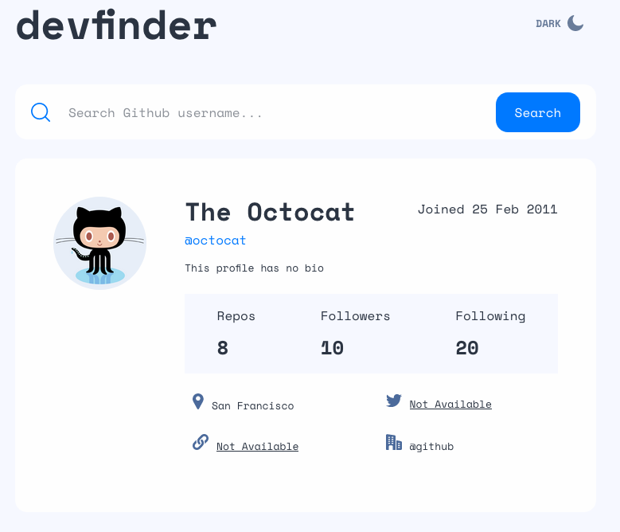
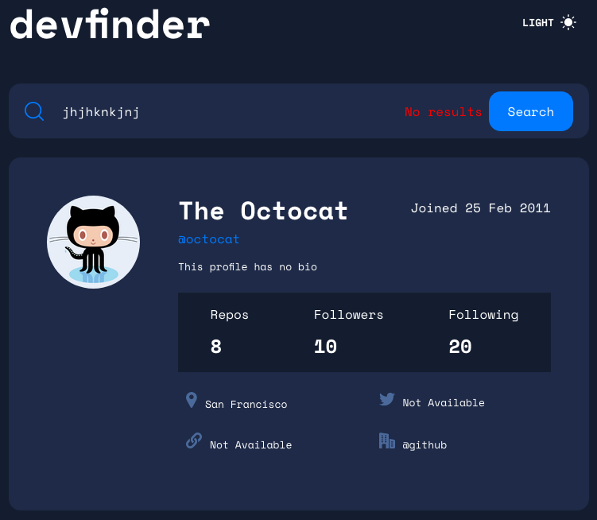

# Frontend Mentor - GitHub user search app
## The challenge

This challenge requires the developer to build a GitHub user search app using the [GitHub users API](https://docs.github.com/en/rest/reference/users#get-a-user) and get it looking as close to the design as possible.

Your users should be able to:

- View the optimal layout for the app depending on their device's screen size
- See hover states for all interactive elements on the page
- Search for GitHub users by their username
- See relevant user information based on their search
- Switch between light and dark themes

The GitHub users API endpoint is `https://api.github.com/users/:username`. Default interface uses the ``octocat`` github profile

### Screenshots

### Expected behaviour

- On first load, the interface shows profile information for ``octocat``
- Display an error message (as shown in the design) if no user is found when a new search is made.
- If a GitHub user hasn't added their name, show their username where the name would be without the `@` symbol and again below with the `@` symbol.
- If a GitHub user's bio is empty, show the text "This profile has no bio" with transparency added (as shown in the design). The lorem ipsum text in the designs shows how the bio should look when it is present.
- If any of the location, website, twitter, or company properties are empty, show the text "Not Available" with transparency added (as shown in the design).
- Website, twitter, and company information should all be links to those resaources. For the company link, it should remove the `@` symbol and link to the company page on GitHub. For Octocat, with `@github` being returned for the company, this would lead to a URL of `https://github.com/github`.
## Building project

* The project is built using:
  * Typescript React
  * SCSS
  * Github API

* [Code](https://github.com/francisldn/fm-github-search)
* [Frontend](https://fm-github-search.vercel.app/)
## Challenges 
* <h4>SCSS setup</h4>
  As this is my first time using SCSS, setting up the folder structure took a while for me, but once it is set up, it provided much easier development experience compared to using vanilla CSS. In particular, I would like to highlight a few things as below.
    - Nesting of CSS selectors - SCSS allows for nesting of selectors which allows for easier maintenance and reading
    - Creating variables using ``@mixin`` and ``@functions`` which provide for reusability
    - Creating CSS group properties such as ``colors`` and ``font`` and then allow for easy retrieval then using ``map-get`` function
    - SCSS function such as ``lighten()`` enables user to easily change color to lighter shade

* <h4>Typescript React</h4>
  I have used React in JS before, but this is my first time using Typescript React for development. Given the strongly-typed nature of Typescript, it took me a longer development time as I had to figure out how to resolve certain error messages which are specific to Typescript. I had found Typescript intimidating in the past and was put off by the longer time requirement for development, but this experience has helped me appreciate Typescript a bit more and understand ways to deal with Typescript-specific errors. 

* <h4>Responsive mobile and tablet layout</h4>
  It took me a while to adjust the desktop layout to tablet and mobile. I eventually used ``position: absolute`` to organise the layout as required. I have learnt various CSS position properties and the pros and cons of using these properties. 

* <h4> Dark mode and light mode & localStorage </h4>
  I have learnt how to set dark and light mode using CSS properties and how to store the state in localStorage, using ``localStorage.getItem()`` and ``localStorage.setItem()`` functions. This allows user to store their viewing mode preference in the local storage and preference will be persisted for their next visit. 

